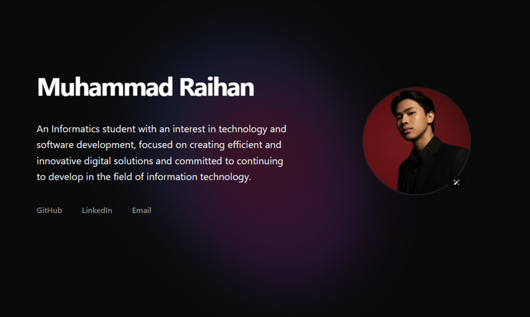

# Muhammad Raihan's Personal Portfolio

This is the source code for my personal portfolio website, built to showcase my projects, skills, and professional background.

The live version can be viewed at: **[Raihan's Portfolio](https://raihan-jiwoo.vercel.app/)**



## ✨ Features

  * **Next.js 15 + React 19:** Built with the latest features of Next.js (App Router) and React.
  * **Component-Based Sections:** The site is divided into logical sections: Hero, Projects, Stack, and Contact.
  * **Dark/Light Mode:** Full support for system-preference or user-toggled dark mode, managed with `next-themes`.
  * **Smooth Scrolling:** Implements `Lenis` for a fluid, smooth scrolling experience.
  * **Rich Animations:**
      * **ScrollReveal:** Subtle fade-in animations as elements enter the viewport.
      * **Framer Motion:** Used for parallax effects in the Hero section and staggered grid animations in the Stack section.
      * **Interactive Hover Effect:** Project cards feature a dynamic radial gradient glow that follows the mouse cursor.
  * **Contact Form:** A functional contact form that integrates with Formspree.

## 💻 Tech Stack

This project is built with a modern, performant tech stack:

  * **Framework:** [Next.js 15](https://nextjs.org/)
  * **Language:** [TypeScript](https://www.typescriptlang.org/)
  * **UI Library:** [React 19](https://react.dev/)
  * **Styling:** [Tailwind CSS 4](https://tailwindcss.com/)
  * **Animation:** [Framer Motion](https://www.framer.com/motion/), [ScrollReveal](https://scrollrevealjs.org/), and [Lenis](https://lenis.studiofreight.com/)
  * **Theming:** [next-themes](https://github.com/pacocoursey/next-themes)
  * **Icons:** [React Icons](https://react-icons.github.io/react-icons/)
  * **Linting:** [ESLint](https://eslint.org/)

## 🚀 Getting Started

### Prerequisites

Make sure you have the following installed on your machine:

  * [Node.js](https://nodejs.org/en/) (v20 or later recommended)
  * [npm](https://www.npmjs.com/) or [yarn](https://yarnpkg.com/)

### Installation

1.  **Clone the repository:**

    ```bash
    git clone https://github.com/hiraihan/portfolio-next.git
    cd portfolio-next
    ```

2.  **Install dependencies:**

    ```bash
    npm install
    # or
    yarn install
    # or
    pnpm install
    ```

3.  **Set up environment variables:**
    This project uses [Formspree](https://formspree.io/) for the contact form. You will need to get your own Formspree endpoint ID.

    Open `src/app/components/sections/Contact.tsx` and replace the placeholder URL with your own:

    ```tsx
    // src/app/components/sections/Contact.tsx
    <form
      id="contact-form"
      action="https://formspree.io/f/YOUR_UNIQUE_ID" // <-- REPLACE THIS
      method="POST"
      onSubmit={handleSubmit}
    >
    ```

### Running the Project

You can run the project using the following scripts:

  * **Development:**
    Runs the app in development mode at `http://localhost:3000`.

    ```bash
    npm run dev
    ```

  * **Build:**
    Builds the app for production.

    ```bash
    npm run build
    ```

  * **Start:**
    Starts the production server (must be run after `build`).

    ```bash
    npm run start
    ```

  * **Lint:**
    Runs ESLint to check for code quality and style issues.

    ```bash
    npm run lint
    ```

## 📁 Project Structure

The project uses the Next.js App Router structure. Key directories and files include:

```
hiraihan/portfolio-next/
├── public/                 # Static assets (images, fonts, favicons)
│   ├── career-compass.png
│   ├── favicon.png
│   └── raihan.png
├── src/
│   ├── app/
│   │   ├── components/
│   │   │   ├── sections/     # Contains Hero, Projects, Stack, Contact, TodoList
│   │   │   ├── ClientLayout.tsx # Smooth scroll (Lenis) wrapper
│   │   │   ├── Container.tsx    # Max-width container component
│   │   │   ├── Header.tsx       # Site header and navigation
│   │   │   ├── ProjectCard.tsx  # Reusable project card
│   │   │   └── ThemeToggle.tsx  # Dark/Light mode switch
│   │   ├── globals.css     # Global styles and Tailwind layers
│   │   ├── layout.tsx      # Root layout (HTML, body tags)
│   │   ├── page.tsx        # The main page (/) entry point
│   │   └── providers.tsx   # ThemeProvider wrapper
│   ├── hooks/
│   │   └── useSmoothScroll.ts # Custom hook for Lenis
├── .gitignore
├── next.config.ts          # Next.js configuration
├── package.json            # Project dependencies and scripts
├── tailwind.config.ts      # Tailwind CSS configuration
└── tsconfig.json           # TypeScript configuration
```

## 🤝 Contributing

Contributions are welcome\! If you find a bug or have an idea for an improvement, please follow these steps:

1.  **Fork** the repository.
2.  Create a new branch (`git checkout -b feature/YourAmazingFeature`).
3.  Make your changes and **commit** them (`git commit -m 'Add some AmazingFeature'`).
4.  **Push** to the branch (`git push origin feature/YourAmazingFeature`).
5.  Open a **Pull Request**.

## 📄 License

This project is licensed under the **MIT License**. See the [LICENSE](https://www.google.com/search?q=LICENSE) file for details.

-----
